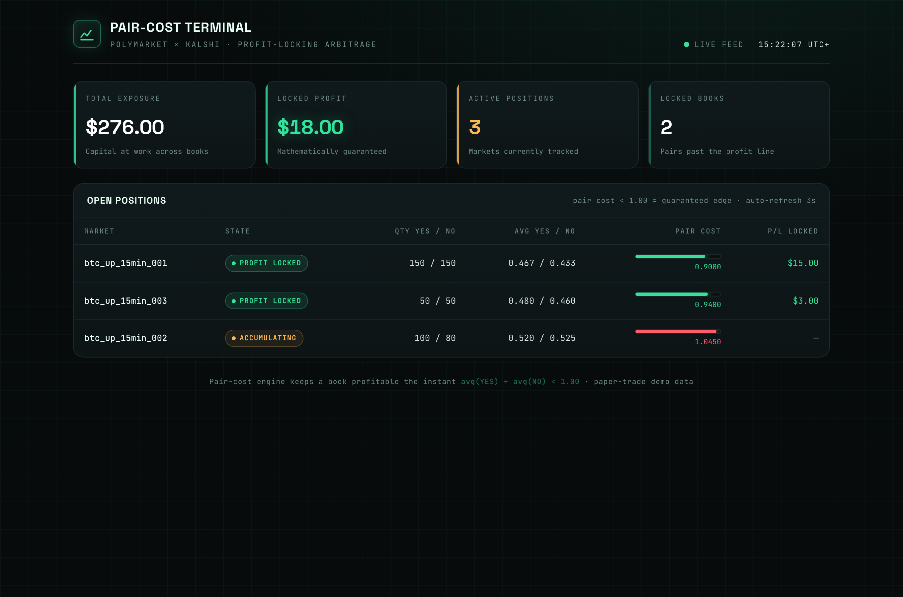
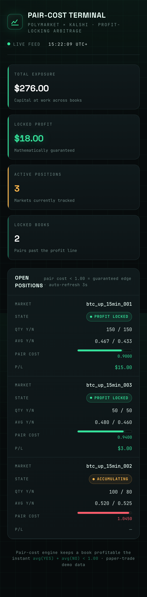

# Hack Finance Bot 🪙⚖️

**A profit-locking arbitrage engine for binary prediction markets — Polymarket × Kalshi — with a live pair-cost trading terminal.**

The whole idea fits on a napkin: in a YES/NO market, if you can accumulate matched YES and NO shares whose **average costs add up to less than $1.00**, one of them is _guaranteed_ to pay out $1.00 at settlement. The moment `avg(YES) + avg(NO) < 1.00`, profit is locked — no prediction required, just patience and disciplined fills. This repo is the machinery that hunts for that edge and a real-time dashboard that shows it happening.



> **Live demo — deploying soon.** Until then, the screenshots above are the real UI, and you can run the whole thing locally in about two minutes (see below).

---

## Why "pair cost"?

Every position tracks one number that rules them all:

```
pair_cost = (cost_of_YES / qty_YES) + (cost_of_NO / qty_NO)
```

- `pair_cost >= 1.00` → still fishing. Keep buying the cheaper leg when it dips below its recent TWAP.
- `pair_cost < 1.00` → **locked.** Whichever way the market settles, `min(qty_YES, qty_NO)` shares redeem at $1.00 and you pocket the difference.

The terminal colours every book by this metric — green under the line, amber near it, red above — so you can read the whole desk at a glance.

## Features

- 🔒 **Profit-locking pair-cost engine** — the math core (`core/pair_cost_engine.py`) that decides when a book is guaranteed green.
- 🧠 **Rule-based decision engine** — TWAP-relative discounts, pair-cost safety margins, imbalance guards, and position-size caps before any fill (`core/decision_engine.py`).
- 📈 **Live trading terminal** — a self-contained dashboard (auto-refresh every 3s) with exposure, locked profit, and a per-market position table. Fully responsive, phosphor-terminal styling, zero build step.
- 📡 **Market scanner** — filters Polymarket for the fast 15-minute BTC books where the edge shows up (`data/market_scanner.py`).
- 🕰️ **Rolling TWAP + volatility** — time-windowed price history for smarter entries (`data/price_history.py`).
- 🗃️ **SQLite trade & position logging** — every fill and snapshot persisted (`data/trade_logger.py`).
- 📊 **Desk-health analytics** — `/api/analytics` derives return-on-exposure, average pair cost, capital concentration, and the book nearest to locking, surfaced as a live strip on the terminal (`core/analytics.py`).
- ⬇️ **Trade blotter export** — one-click CSV download of the full fill history from the header (`/api/trades.csv`).
- ❤️ **Health endpoint** — `/api/health` reports uptime and readiness for uptime monitors.
- 🧾 **Paper-trade first** — the shipped demo simulates a live desk so you can watch a book cross the profit line with zero risk.

## Screens

| Desktop terminal | On the phone |
| --- | --- |
|  |  |

---

## Quick start (about 2 minutes)

### Prerequisites

- **Python 3.10+** — check with `python3 --version`
- **pip** (ships with Python) and the ability to make a virtual environment

That's it. The demo dashboard needs only two packages and no API keys.

### 1. Grab the code

```bash
git clone https://github.com/waleedsworld/hack-finance-bot.git
cd hack-finance-bot
```

### 2. Make a virtual environment (keeps your system Python tidy)

```bash
python3 -m venv .venv
source .venv/bin/activate        # Windows: .venv\Scripts\activate
```

### 3. Install dependencies

For just the **live dashboard demo**, the two essentials are enough:

```bash
pip install fastapi uvicorn
```

For the **full bot** (exchange clients, numerics, alerts):

```bash
pip install -r requirements.txt
```

### 4. Launch the terminal

```bash
python start.py
```

Then open **http://localhost:5108** in your browser. You'll see three simulated BTC books — two already profit-locked, one still accumulating — updating live. Want a different port?

```bash
PORT=8080 python start.py
```

> Tip: `start.py` seeds a paper-trade desk so there's always something to look at. No keys, no money, no risk.

---

## Going live (optional)

Real trading needs credentials. Copy them into a `.env` file at the project root:

```env
# Polymarket
POLYMARKET_PRIVATE_KEY=your_wallet_private_key
POLYMARKET_RPC_URL=https://polygon-rpc.com
POLYMARKET_CLOB_URL=https://clob.polymarket.com

# Kalshi
KALSHI_API_KEY=your_kalshi_key
KALSHI_API_SECRET=your_kalshi_secret

# Safety rails
DRY_RUN_MODE=true          # keep this true until you trust it
ENABLE_AUTO_TRADING=false
SAFETY_MARGIN=0.99         # never let pair cost cross this on a buy
MAX_POSITION_SIZE=1000
```

All knobs are read in `config.py`, so tweak there or via environment variables. **Please leave `DRY_RUN_MODE=true` while you learn the system** — this is real money against real order books, and the safety margin is your friend.

## Project structure

```
hack-finance-bot/
├── start.py                 # ▶ entry point — dashboard + paper-trade demo
├── config.py                # environment-driven configuration
├── core/
│   ├── pair_cost_engine.py  # the profit-locking math (MarketPosition)
│   ├── decision_engine.py   # buy/skip rules (TWAP, safety, imbalance)
│   └── position_tracker.py  # portfolio-wide exposure & locked profit
├── data/
│   ├── market_scanner.py    # find active 15-min BTC markets
│   ├── price_history.py     # rolling TWAP / volatility window
│   └── trade_logger.py      # SQLite trade + position persistence
└── dashboard/
    ├── api.py               # FastAPI endpoints (/api/stats, /positions, /health)
    └── static/index.html    # the live pair-cost terminal UI
```

## API endpoints

| Method | Path | Returns |
| --- | --- | --- |
| `GET` | `/` | The dashboard UI |
| `GET` | `/api/stats` | Total exposure, locked profit, active/locked counts |
| `GET` | `/api/positions` | Every tracked book with pair cost & lock state |
| `GET` | `/api/trades/{market_id}` | Trade history for one market |
| `GET` | `/api/health` | Liveness, uptime, component readiness |

## Testing

The core strategy math, persistence layer, and dashboard API are covered by a
`pytest` suite under `tests/`. Install the dev dependencies and run it:

```bash
pip install -r requirements.txt -r requirements-dev.txt
pytest
```

What's covered:

- `pair_cost_engine` — average cost, pair cost, `simulate_buy` (no mutation), and profit-lock math
- `decision_engine` — every buy/skip rule (TWAP discount, safety margin, imbalance, max position)
- `position_tracker` — exposure and locked-profit aggregation across books
- `price_history` — rolling TWAP, volatility, and window pruning
- `trade_logger` — SQLite round-trips against a temporary database
- `market_scanner` — BTC 15-min filtering and market liveness
- `dashboard/api` — all endpoints via FastAPI's `TestClient`

Tests use a throwaway SQLite file per test and never touch the network, so the
suite runs offline in well under a second.

## A word on risk ⚠️

This is educational software for studying market microstructure and arbitrage mechanics. Prediction markets are volatile, fills are not guaranteed, and "risk-free" only holds if _both_ legs actually get filled at the prices you modelled. Start in paper-trade mode, understand every rule in `decision_engine.py`, and never deploy capital you can't afford to lose. Not financial advice — just a fun, honest look at how locked-in edges work.

## License

MIT — do cool things with it.
